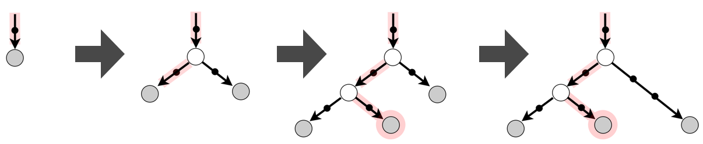

# Adaptive Neural Trees

[](LICENSE.md)

This repository contains our PyTorch implementation of Adaptive Neural Trees (ANTs).

The code was written by [Ryutaro Tanno](https://rt416.github.io/) and 
supported by [Kai Arulkumaran](http://kaixhin.com). 

[Paper (ICML'19)](http://proceedings.mlr.press/v97/tanno19a.html) | [Video from London ML meetup](https://www.youtube.com/watch?v=v0bv0HTboOg&t=376s)



# Prerequisites
- Linux or macOS
- Python 2.7
- Anaconda >= 4.5 
- CPU or NVIDIA GPU + CUDA 8.0 

# Installation

- Clone this repo:
```bash
git clone https://github.com/rtanno21609/AdaptiveNeuralTrees.git
cd AdaptiveNeuralTrees
```
- (Optional) create a new Conda environment and activate it:
```bash
conda create -n ANT python=2.7
source activate ANT
```
- Run the following to install required packages.
``` 
bash ./install.sh
```

## Usage

An example command for training/testing an ANT is given below.

```bash
python tree.py --experiment test_ant_cifar10  #name of experiment \
               --subexperiment myant  #name of subexperiment \
               --dataset cifar10   #dataset \
                # Model details:    \
               --router_ver 3        #type of router module \
               --router_ngf 128      #no. of kernels in routers \
               --router_k 3          #spatial size of kernels in routers \
               --transformer_ver 5   #type of transformer module \
               --transformer_ngf 128 #no. of kernels in transformers \
               --transformer_k 3     #spatial size of kernels in transformers \
               --solver_ver 6        #type of solver module \
               --batch_norm          #apply batch-norm \
               --maxdepth 10         #maximum depth of the tree-structure \
                # Training details: \
               --batch-size 512    #batch size \
               --augmentation_on   #apply data augmentation \
               --scheduler step_lr #learning rate scheduling \
               --criteria avg_valid_loss # splitting criteria
               --epochs_patience 5 #no. of patience per node for growth phase \
               --epochs_node 100   #max no. of epochs per node for growth phase \
               --epochs_finetune 200 #no. of epochs for fine-tuning phase \
               # Others: \
               --seed 0            #randomisation seed
               --num_workers 0     #no. of CPU subprocesses used for data loading \
               --visualise_split  # save the tree structure every epoch \
```
The model configurations and optimisation trajectory (e.g value of
train/validation loss at each time point) are saved in `records.jason` in the 
directory `./experiments/dataset/experiment/subexperiment/checkpoints`. Similarly,
tree structure and best trained model are saved as `tree_structures.json`
and `model.pth`, respectively under the same directory. If the visualisation option 
`--visualise_split` is used, the tree architecture of the ANT is saved in the PNG
format in the directory `./experiments/dataset/experiment/subexperiment/cfigures`.

By default, the average classification accuracy is also computed
on train/valid/test sets for every epoch and saved in `records.jason` file, so
running `tree.py` would suffice for both training and testing an ANT of particular 
configurations. 

**Jupyter Notebooks**

We have also included two Jupter notebooks `./notebooks/example_mnist.ipynb`
and `./notebooks/example_cifar10.ipynb`, which illustrate how this repository 
can be used to train ANTs on MNIST and CIFAR-10 image recognition datasets. 


**Primitive modules**

Defining an ANT amounts to specifying the forms of primitive modules: routers,
transformers and solvers. The table below provides the list of currently implemented
primitive modules. You can try any combination of three
to construct an ANT. 

| Type | Router | Transformer  | Solver |
| ------------- |:-------------:  | :-----------:|:-----:|
| 1     | 1 x Conv + GAP + Sigmoid | Identity function | Linear classifier  |
| 2     | 1 x Conv + GAP + 1 x FC   | 1 x Conv | MLP with 2 hidden layers  |
| 3     | 2 x Conv + GAP + 1 x FC   | 1 x Conv + 1 x MaxPool | MLP with 1 hidden layer |
| 4     | MLP with 1 hidden layer   | Bottleneck residual block ([He et al., 2015](https://arxiv.org/abs/1512.03385)) | GAP + 2 FC layers + Softmax |
| 5     | GAP + 2 x FC layers ([Veit et al., 2017](https://arxiv.org/abs/1711.11503)) | 2 x Conv + 1 x MaxPool | MLP with 1 hidden layer in AlexNet ([layers-80sec.cfg](https://github.com/BVLC/caffe/blob/master/examples/mnist/lenet.prototxt))    |
| 6     | 1 x Conv +  GAP + 2 x FC | Whole VGG13 architecture (without the linear layer) | GAP + 1 FC layers + Softmax  |

For the detailed definitions of respective modules, please see `utils.py` and 
`models.py`. 

## Citation
If you use this code for your research, please cite our ICML paper:
```
@inproceedings{AdaptiveNeuralTrees19,
  title={Adaptive Neural Trees},
  author={Tanno, Ryutaro and Arulkumaran, Kai and Alexander, Daniel and Criminisi, Antonio and Nori, Aditya},
  booktitle={Proceedings of the 36th International Conference on Machine Learning (ICML)},
  year={2019},
}
```

## Acknowledgements
I would like to thank
[Daniel C. Alexander](http://www0.cs.ucl.ac.uk/staff/d.alexander/) at University College London, UK, 
[Antonio Criminisi](https://scholar.google.co.uk/citations?user=YHmzvmMAAAAJ&hl=en/) at Amazon Research, 
and [Aditya Nori](https://www.microsoft.com/en-us/research/people/adityan/) at Microsoft Research Cambridge
for their valuable contributions to this paper. 


